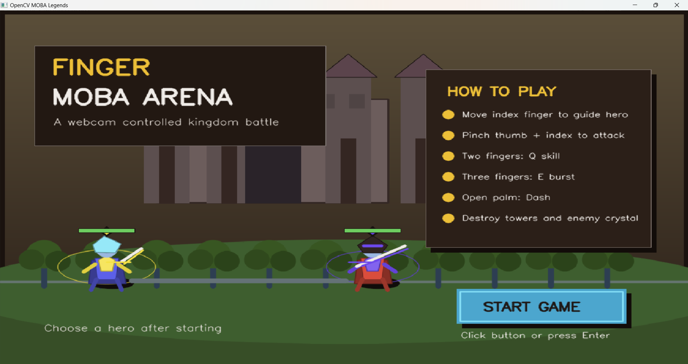
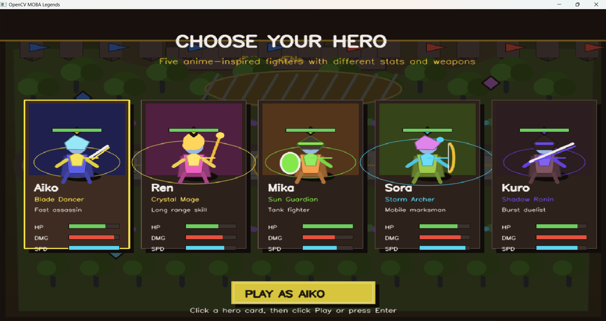
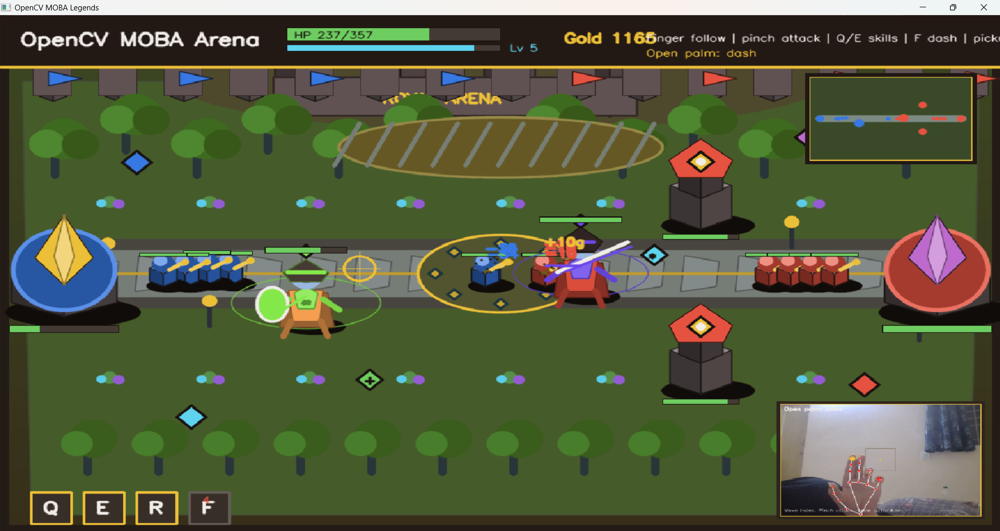

# 🎮 Finger MOBA Arena

> **A webcam-controlled kingdom battle — built with Python & OpenCV**

Control your hero with real hand gestures through your webcam. No mouse. No joystick. Just your fingers. Push lanes with allied minions, destroy enemy towers, and crush the enemy crystal to win!

---

## 📸 Screenshots

### 🏠 Main Menu

*Title screen showing game controls overview — click START GAME or press Enter to begin*

---

### 🦸 Hero Selection

*Choose from five anime-inspired fighters — each with unique stats, weapons and playstyle*

---

### ⚔️ Gameplay

*Live match with real-time webcam hand-tracking (bottom-right), minimap (top-right), gold counter and skill HUD*

---

## ✨ Features

- 🖐️ **Real-time hand gesture control** via OpenCV + MediaPipe
- 🧙 **5 unique heroes** — Aiko, Ren, Mika, Sora, and Kuro — each with different stats and weapons
- 🏰 **Full MOBA loop** — lanes, allied minions, towers, and a base crystal to destroy
- ⚔️ **Multiple abilities** — basic attacks, skill shots, area bursts, and dashes
- 🗺️ **Mini-map** for situational awareness
- 💰 **Gold & leveling system**
- ⌨️ **Keyboard fallback** controls fully supported
- 📷 **Live webcam preview** with hand skeleton overlay

---

## 🦸 Heroes

| Hero | Class | Playstyle |
|------|-------|-----------|
| **Aiko** | Blade Dancer | Fast assassin |
| **Ren** | Crystal Mage | Long range skill |
| **Mika** | Sun Guardian | Tank fighter |
| **Sora** | Storm Archer | Mobile marksman |
| **Kuro** | Shadow Ronin | Burst duelist |

---

## 🖐️ Gesture Controls

| Gesture | Action |
|---------|--------|
| Move index finger (outside neutral zone) | Move hero |
| Pinch thumb + index finger | Basic attack |
| Raise index + middle fingers | Q — Skill shot |
| Raise index + middle + ring fingers | E — Area burst |
| Open palm | Dash |
| Make a fist | Regenerate HP |

> 💡 **Tip:** Keep your hand visible in the **Hand Control Camera** window. The small center box is the **neutral zone** — moving your index finger outside it moves the hero. If the wrong camera opens or the preview is black, press **`C`**.

---

## ⌨️ Keyboard Fallback

| Key | Action |
|-----|--------|
| `W` `A` `S` `D` | Move hero |
| `Space` / `Q` / `E` / `R` | Skills |
| `F` | Dash |
| `P` | Pause |
| `C` | Switch camera |
| `1` – `5` | Pick hero on selection screen |
| `Enter` | Confirm / Start |
| `Esc` | Quit |

---

## 🚀 Setup & Installation

**1. Clone the repository**
```bash
git clone https://github.com/ompreet-s/moba-arena.git
cd moba-arena
```

**2. Create and activate a virtual environment**
```bash
python -m venv .venv

# Windows (PowerShell)
.\.venv\Scripts\Activate.ps1

# macOS / Linux
source .venv/bin/activate
```

**3. Install dependencies**
```bash
pip install -r requirements.txt
```

**4. Run the game**
```bash
python moba_legends_opencv.py
```

---

## 🎯 How to Play

1. Game opens on the **title screen** → click `START GAME` or press `Enter`
2. On the **hero selection screen**, click a hero card → click **Play** or press `Enter`
3. Keep your **hand visible** in the webcam preview — move your index finger outside the neutral zone to move your hero
4. If the wrong camera opens or preview is black → press **`C`** to switch cameras
5. Push the lane with your allied minions → destroy all **enemy towers** → destroy the **enemy crystal** to win!
6. Return to your **starting base** to refill HP — dying respawns you there after a short delay
7. After victory → click **PLAY AGAIN** or **EXIT**

---

## 🗂️ Project Structure

```
moba-arena/
├── moba_legends_opencv.py   # Main game (all-in-one)
├── requirements.txt          # Python dependencies
├── myfolder/                 # Screenshots
│   ├── begin.png             # Main menu
│   ├── players.png           # Hero selection
│   └── battle.png            # Gameplay
└── README.md
```

---

## 🛠️ Tech Stack

| Library | Purpose |
|---------|---------|
| **Python 3** | Core language |
| **OpenCV** | Webcam capture & image processing |
| **MediaPipe** | Hand landmark & gesture detection |
| **Pygame** | 2D game rendering & event loop |

---

## 📄 License

Open source — feel free to fork, mod, and build on it!

---

## 👨‍💻 Developed By

<div align="center">

| Developer | GitHub |
|---|---|
| ompreet-s | [@ompreet-s](https://github.com/ompreet-s) | [Team Leader]
| Supreet37 | [@Supreet37](https://github.com/Supreet37) |
| sudeshna-24 | [@sudeshna-24](https://github.com/sudeshna-24) |


